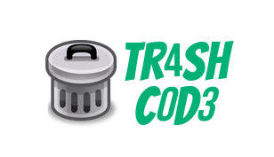
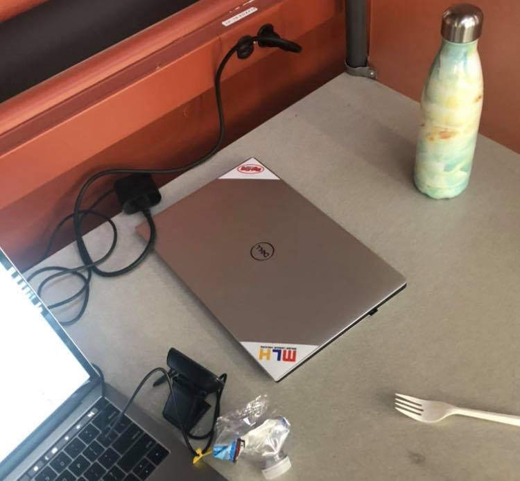
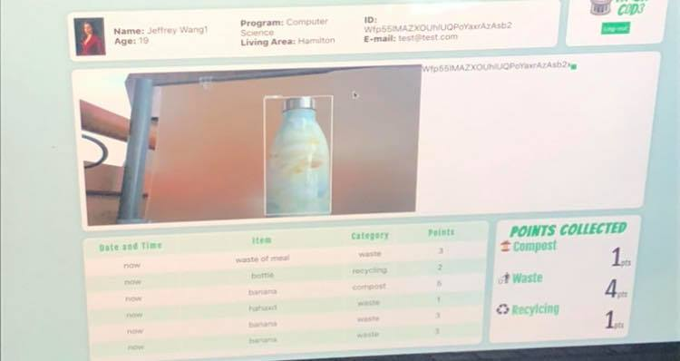
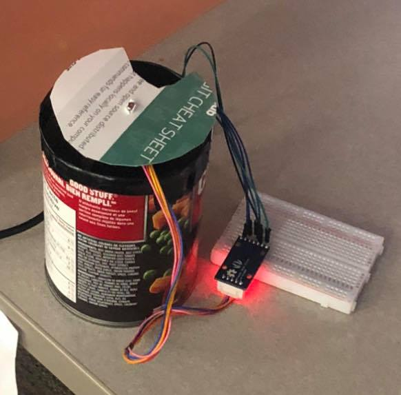

# Tr4sh C0d3

Connect with us:
<a href="https://www.linkedin.com/in/cathkychen/">Catherine Chen</a> - <a href="https://www.linkedin.com/in/farhanmoh/">Farhan Mohammed</a> - <a href="https://www.linkedin.com/in/wangw115/)">Jeffrey Wang</a> - <a href="https://www.linkedin.com/in/uzairmahmed/">Uzair Ahamed</a>

This project was created as an entry for DeltaHacks 2020 and ended up winning ArcelorMittal's runner-up prize as well as domain.com's best domain challenge.

Here are a few pictures from our project:

There's a webcam feeding a live stream to tensorflow, which analyzes the pictures and sends the images to a server.

We created a user system to give people points for throwing things in the write bins as an incentive to save our envrionment. When the user is near a bin, you can view the feed on the website.

We created a mock bin to showcase how a real bin would operate. Using an arduino and a motor, the lid changed states from closed to recyling/waste/compost depending on what kind of trash the user is dispoing.

## Our Inspiration
Canadians produce more garbage per capita than any other country on earth, with the United States ranking third in the world. In fact, Canadians generate approximately 31 million tonnes of garbage a year. According to the Environmental Protection Agency, 75% of this waste is recyclable. Yet, only 30% of it is recycled. In order to increase this recycling rate and reduce our environmental impact, we were inspired to propose a solution through automating waste sorting.

## What it does
Our vision takes control away from the user, and lets the machine do the thinking when it comes to waste disposal! By showing our app a type of waste through the webcam, we detect and classify the category of waste into either recyclable, compost, or landfill. From there, the appropriate compartment is opened to ensure that the right waste gets to the right place!

## How we built it
Using TensorFlow and object detection, a python program analyzes the webcam image input and classifies the objects shown. The TensorFlow data is then collected and pushed to our MongoDB Atlas database via Google Cloud. For this project, we used machine learning and used a single shot detector model to maintain a balance between accuracy and speed. For the hardware, an Arduino 101 and a step motor were responsible for manipulating the position of the lid and opening the appropriate compartment.

